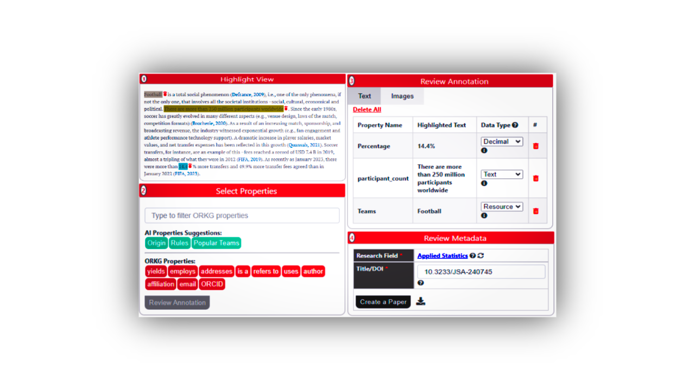

# ORKGEx

## Introduction

This repository contains the code for a novel approach to enhance the semantic description and annotation of research articles. The approach includes tools for web-based annotation directly within browsers, seamlessly integrated with the [Open Research Knowledge Graph (ORKG)](https://orkg.org/). It also features methods for extracting knowledge from complex figure data, bridging textual and visual information in scholarly communication.
## Demo Video

This short video demonstrates the ORKGEx Chrome extension in action — showcasing annotation, extraction, and integration with the ORKG platform.

## Installation and Usage

### Loading the Chrome Extension

To load and test the Chrome extension locally:

1. Clone or download this repository to your local machine.
   
2. Open Google Chrome and navigate to `chrome://extensions`.

3. Enable Developer Mode by toggling the switch in the upper-right corner.

4. Click on "Load unpacked" and select the directory where the extension files (`manifest.json`, `background.js`, etc.) are located.

5. The extension should now appear in the list of installed extensions. You can interact with it by clicking on "Details" and selecting "Extension options" or managing its behavior.

## Contributing

Pull requests are welcome. For major changes, please open an issue first to discuss what you would like to change.

## License

[MIT]([link-to-license](https://opensource.org/license/mit))

